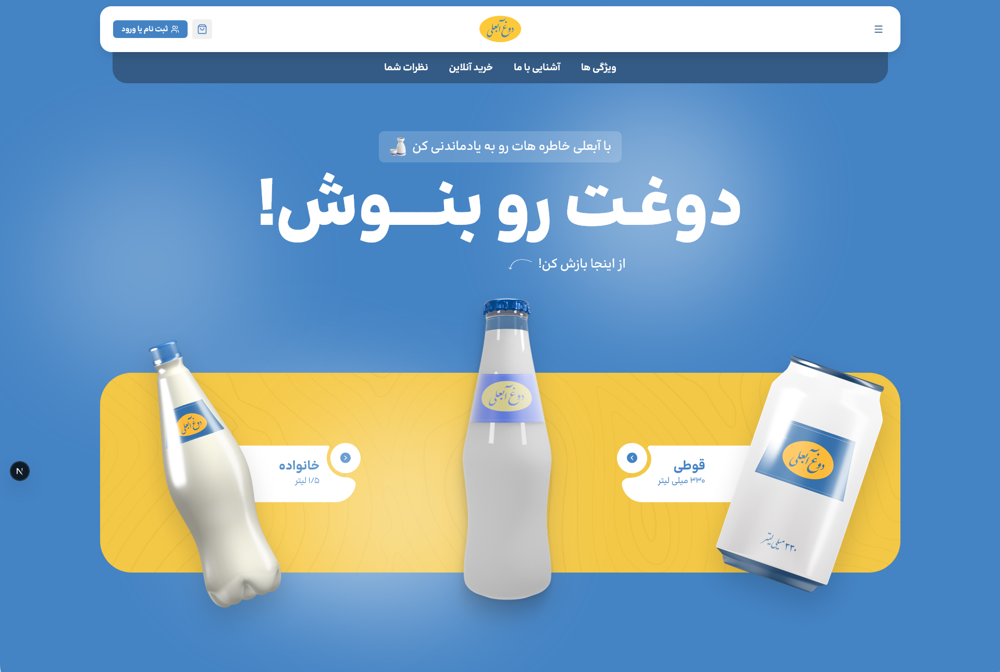

<div align="center">

# 🥛 Dogheabali

**A pixel-matched, fully responsive Next.js recreation of a Persian doogh (yogurt drink) landing page, built from a public Figma design.**




</div>

---

## ✨ Features

- 🎯 **Pixel-matched to Figma** — built section-by-section against a real [Figma Community design](https://www.figma.com/design/TozUBLqPD8ZwtYaLAyIDLg/Dogheabali---Landingpage--Community-), including RTL layout, spacing, and typography
- 🇮🇷 **Full RTL, Persian-first** — `lang="fa" dir="rtl"`, self-hosted variable Persian font (Bonyade Koodak), literal Persian-Indic and Latin numerals matched to the source design
- 🖼️ **Nine composed sections** — header, hero, features carousel, video, shop, animated stats, info/about, customer reviews carousel, footer
- 🔄 **Interactive UI** — auto/manual features carousel, gas/no-gas product toggle, animated count-up stats, region-based reviews carousel with an interactive Iran map
- 📱 **Responsive** — desktop-down-to-mobile layout, inferred and hand-built since the source Figma file is desktop-only

> This is a static front-end showcase — there's no backend, cart, or auth logic. UI like "add to cart," "login," and social links are intentionally decorative, matching the scope of the source design.

## 🧰 Tech Stack

| Layer | Tech |
|---|---|
| Framework | Next.js 16 (App Router, Turbopack) |
| UI | React 19, TypeScript |
| Styling | Tailwind CSS v4 |
| Components | shadcn/ui on [Base UI](https://base-ui.com) (`@base-ui/react`) |
| Icons | lucide-react + hand-written social SVGs |
| Animation | react-countup |

## 📁 Project Structure

```
src/
  app/                    → layout.tsx, page.tsx, globals.css
  components/
    sections/             → Header, Hero, Features, Video, Shop, Stats, Info, Reviews, Footer
    ui/                   → shadcn primitives
    icons/                → hand-written social icon SVGs
  fonts/                  → Bonyade Koodak variable font (.woff2)
  lib/                    → utils (cn, etc.)
public/images/            → exported, sanitized design assets
```

## 🚀 Getting Started

### Requirements
- Node.js 18+

### Setup

```bash
npm install
npm run dev
```

Open [http://localhost:3000](http://localhost:3000). No environment variables or database needed — it's a fully static site.

## 🔗 Links

- **Live demo:** [dogheabali.vercel.app](https://dogheabali.vercel.app/)
- **Source design:** [Figma Community file](https://www.figma.com/design/TozUBLqPD8ZwtYaLAyIDLg/Dogheabali---Landingpage--Community-)

## ⚠️ Disclaimer

This is a portfolio/practice project built to faithfully implement a public Figma Community design end-to-end — it is not an official site for the Dogh Abali / Behnoush Iran brand, and isn't affiliated with or endorsed by them. Product imagery, branding, and contact details reproduce the source design as published.

---

<div align="center">

Built with Next.js, Tailwind CSS, and a pixel ruler.

</div>
